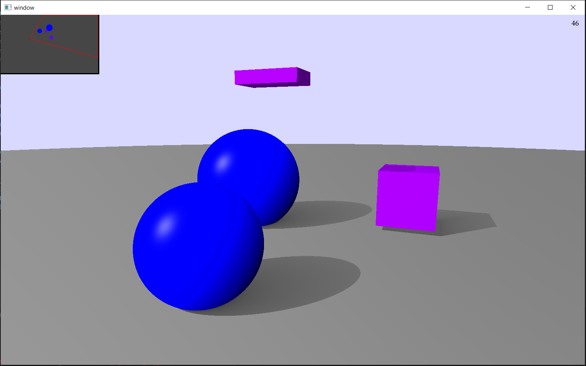

# 🖼️ Ray Tracing on GPU with C++ and SFML



Данный проект представляет собой программу для рендеринга 3D-сцены методом трассировки лучей (ray tracing), полностью вычисляемой на видеокарте с использованием шейдеров OpenGL. Управление окном и вводом осуществляется через библиотеку SFML. Основная цель – достижение высокой производительности (стабильные 60 FPS) при реалистичном освещении и гибкой архитектуре сцены.

## ✨ Особенности

- **Полностью аппаратное ускорение** – все вычисления трассировки лучей выполняются в шейдерах (фрагментный / compute), что позволяет задействовать GPU.
- **Реалистичное освещение** – мягкие тени, отражения, поддержка разных материалов (диффузный, зеркальный, стекло).
- **Высокая производительность** – стабильные 60 FPS за счёт использования пространственной структуры BVH (Bounding Volume Hierarchy) для ускорения пересечений лучей.
- **Гибкая архитектура** – легко добавлять новые примитивы (сферы, плоскости, треугольники) и источники света без изменения ядра рендерера.
- **Мини-карта** – отображение сцены сверху с положением камеры и направлением взгляда для удобной навигации.
- **Кроссплатформенность** – благодаря SFML и OpenGL проект можно собрать под Linux, Windows.

## 🛠️ Технологии

- **Язык**: C++20
- **Графика**: OpenGL (шейдеры GLSL)
- **Оконный менеджер и ввод**: SFML
- **Сборка**: CMake
- **Оптимизация**: BVH, профилирование шейдеров

## 🔧 Установка и сборка

### Требования

- Компилятор с поддержкой C++20 (GCC 10+, Clang 10+, MSVC 2019+)
- CMake 3.15+
- Библиотека SFML 2.6.1
- OpenGL (драйверы, поддерживающие как минимум OpenGL 3.3)
- Система сборки Make

### Инструкция для Linux (Ubuntu/Debian)

1. Установите зависимости:
   ```bash
   sudo apt update
   sudo apt install build-essential cmake libsfml-dev mesa-common-dev libgl1-mesa-dev
   ```

2. Склонируйте репозиторий:
   ```bash
   git clone https://github.com/ender019/Project_RayTracing/tree/develop3d
   cd Project_RayTracing
   ```

3. Создайте папку сборки и соберите проект:
   ```bash
   mkdir build && cd build
   cmake .. -DCMAKE_BUILD_TYPE=Release
   make -j$(nproc)
   ```

4. Запустите программу:
   ```bash
   ./prj
   ```

### Инструкция для Windows

1. Установите [CMake](https://cmake.org/download/) и [SFML](https://www.sfml-dev.org/download/sfml/2.6.1/) (скачайте компилированную версию для вашей версии Visual Studio).
2. Укажите путь к SFML в переменной окружения `SFML_DIR` или передайте его в CMake.
3. Откройте папку проекта в Visual Studio (поддерживается встроенная интеграция CMake) или сгенерируйте решение через CMake GUI. Также можно через консоль
    ```bash
    mkdir build && cd build
    cmake .. -DCMAKE_BUILD_TYPE=Release
    cmake build .
    ```
4. Запустите программу:
   ```bash
   ./prj.exe
   ```

## 🎮 Использование

- **WASD** – перемещение камеры вперёд/влево/назад/вправо.
- **мышь** – поворот камеры..
- **ESC** – выход из программы.

Сцена по умолчанию содержит несколько сфер с разными материалами (металл, стекло, диффузный) и точечный источник света.

## 🏗️ Архитектура

- **main.cpp** – инициализация SFML окна, создание контекста OpenGL, главный цикл.
- **shaders/** – GLSL шейдеры:
  - `raytrace.frag` – фрагментный шейдер, выполняющий трассировку лучей.
  - `minimap.frag` – шейдер для отрисовки мини-карты.
- **src/Scene.cpp** – описание сцены: примитивы, материалы, освещение, BVH.
- **src/Camera.cpp** – управление камерой и генерация лучей.
- **src/BVH.cpp** – построение и обход дерева BVH для ускорения пересечений.

Алгоритм работы:
1. На CPU строится BVH для статической сцены.
2. В главном цикле для каждого кадра:
   - Обновляется камера на основе ввода.
   - Шейдер выполняет трассировку: для каждого пикселя генерируется луч, проверяется пересечение с BVH, вычисляется цвет с учётом материалов и источников света.
   - Результат выводится на экран.
   - Дополнительно отрисовывается мини-карта (вид сверху) с помощью отдельного шейдера.

## ⚡ Производительность

- **60 FPS** достигается благодаря:
  - BVH, сокращающему количество проверок пересечений с O(log N) вместо O(N).
  - Оптимизированным шейдерам (ручное профилирование, разворачивание циклов, использование встроенных функций).
  - Минимальному копированию данных между CPU и GPU (сцена загружается один раз).
- В зависимости от сложности сцены частота кадров может варьироваться; при 4–8 примитивах и 1080p держится стабильно 60 FPS.

## 🚀 Планы по развитию

- [ ] Добавить поддержку текстур.
- [ ] Реализовать ambient occlusion.
- [ ] Интерактивное редактирование сцены.
- [ ] Поддержка множества источников света.
- [ ] Экспорт изображения в файл.

---

Проект создан в рамках изучения методов компьютерной графики и оптимизации рендеринга на GPU.
